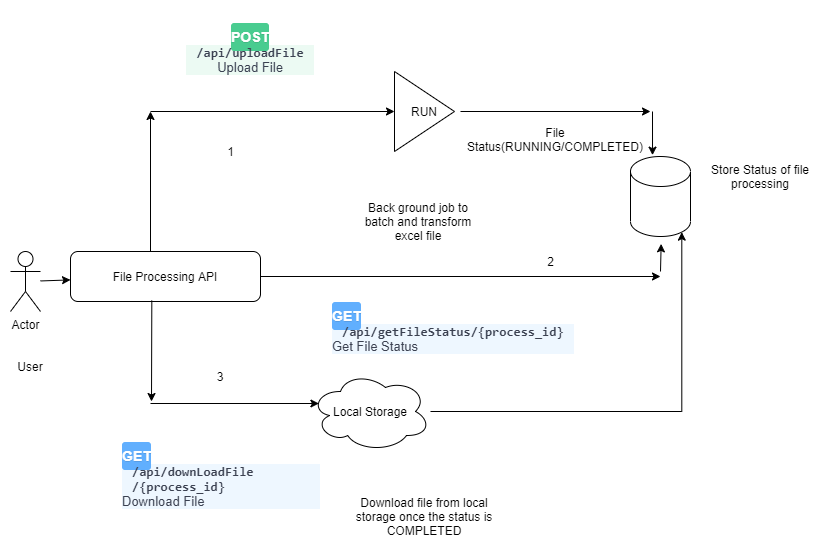

### File Processing API


## Overview

1) User will upload the excel file with /api/uploadFile end point . This will
return a unique id and run the file processing in background. It will store
the state of the file in status.csv file. (DB can be impletemented here )


2) User can check the file status with endpoint
    /api/getFileStatus/{process_id}

3) User can download the csv file once it is processed from endpoint
/api/downLoadFile/{process_id}


## Run your application with Docker Compose

You need to have docker compose installed in your system

```bash
docker-compose up -d --build
```
It makes your application running in port 8002 . Test your application in swagger UI below

http://localhost:8002/docs

### Download open API specs from 

http://localhost:8002/redoc


